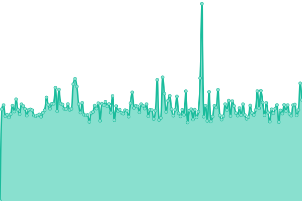

# [📈 Live Status](https://adrianocortes.github.io/TrinusTech): <!--live status--> **🟧 Partial outage**

This repository contains the open-source uptime monitor and status page for [Adriano Côrtes Vieira](https://adrianocortes.github.io/TrinusTech), powered by [Upptime](https://github.com/upptime/upptime).

With [Upptime](https://upptime.js.org), you can get your own unlimited and free uptime monitor and status page, powered entirely by a GitHub repository. We use [Issues](https://github.com/adrianocortes/TrinusTech/issues) as incident reports, [Actions](https://github.com/adrianocortes/TrinusTech/actions) as uptime monitors, and [Pages](https://adrianocortes.github.io/TrinusTech) for the status page.

<!--start: status pages-->
<!-- This summary is generated by Upptime (https://github.com/upptime/upptime) -->
<!-- Do not edit this manually, your changes will be overwritten -->
<!-- prettier-ignore -->
| URL | Status | History | Response Time | Uptime |
| --- | ------ | ------- | ------------- | ------ |
|  [ProdAPIAuthsService](https://prodapiauthservice.azurewebsites.net/swagger/index.html) | Ativo | [prod-api-auths-service.yml](https://github.com/adrianocortes/TrinusTech/commits/HEAD/history/prod-api-auths-service.yml) | 

 696ms
     
 | 

<a href="https://adrianocortes.github.io/TrinusTech/history/prod-api-auths-service">100.00%</a>
    

|  [ProdAPIBilletService](https://prodapibilletservice.azurewebsites.net/swagger/index.html) | Ativo | [prod-api-billet-service.yml](https://github.com/adrianocortes/TrinusTech/commits/HEAD/history/prod-api-billet-service.yml) | 

 680ms
     
 | 

<a href="https://adrianocortes.github.io/TrinusTech/history/prod-api-billet-service">100.00%</a>
    

|  [ProdAPIFavorecidos](https://prodapifavorecidos.azurewebsites.net/swagger/index.html) | Ativo | [prod-api-favorecidos.yml](https://github.com/adrianocortes/TrinusTech/commits/HEAD/history/prod-api-favorecidos.yml) | 

 706ms
     
 | 

<a href="https://adrianocortes.github.io/TrinusTech/history/prod-api-favorecidos">100.00%</a>
    

|  [ProdAPIMypropertiesService](https://prodapimypropertiesservice.azurewebsites.net/swagger/index.html) | Ativo | [prod-api-myproperties-service.yml](https://github.com/adrianocortes/TrinusTech/commits/HEAD/history/prod-api-myproperties-service.yml) | 

 671ms
     
 | 

<a href="https://adrianocortes.github.io/TrinusTech/history/prod-api-myproperties-service">100.00%</a>
    

|  [ProdAPIOnboardingService](https://prodapionboardingservice.azurewebsites.net/swagger/index.html) | Ativo | [prod-api-onboarding-service.yml](https://github.com/adrianocortes/TrinusTech/commits/HEAD/history/prod-api-onboarding-service.yml) | 

 676ms
     
 | 

<a href="https://adrianocortes.github.io/TrinusTech/history/prod-api-onboarding-service">100.00%</a>
    

|  [prodapitedservice](https://prodapitedservice.azurewebsites.net/swagger/index.html) | Ativo | [prodapitedservice.yml](https://github.com/adrianocortes/TrinusTech/commits/HEAD/history/prodapitedservice.yml) | 

 680ms
     
 | 

<a href="https://adrianocortes.github.io/TrinusTech/history/prodapitedservice">100.00%</a>
    

|  [ProdAPITotalsService](https://prodapitotalsservice.azurewebsites.net/swagger/index.html) | Ativo | [prod-api-totals-service.yml](https://github.com/adrianocortes/TrinusTech/commits/HEAD/history/prod-api-totals-service.yml) | 

 675ms
     
 | 

<a href="https://adrianocortes.github.io/TrinusTech/history/prod-api-totals-service">100.00%</a>
    

|  [ProdAPIUserService](https://prodapiuserservice.azurewebsites.net/swagger/index.html) | Ativo | [prod-api-user-service.yml](https://github.com/adrianocortes/TrinusTech/commits/HEAD/history/prod-api-user-service.yml) | 

 668ms
     
 | 

<a href="https://adrianocortes.github.io/TrinusTech/history/prod-api-user-service">100.00%</a>
    

|  [ProdAPIWebhookService](https://prodapiwebhookservice.azurewebsites.net/swagger/index.html) | Ativo | [prod-api-webhook-service.yml](https://github.com/adrianocortes/TrinusTech/commits/HEAD/history/prod-api-webhook-service.yml) | 

 676ms
     
 | 

<a href="https://adrianocortes.github.io/TrinusTech/history/prod-api-webhook-service">100.00%</a>
    

|  [Trinus.CO](https://trinus.co) | Fora do Ar | [trinus-co.yml](https://github.com/adrianocortes/TrinusTech/commits/HEAD/history/trinus-co.yml) | 

 674ms
     
 | 

<a href="https://adrianocortes.github.io/TrinusTech/history/trinus-co">0.00%</a>
    

|  [TrinuStore](http://trinustore.trinus.co) | Fora do Ar | [trinu-store.yml](https://github.com/adrianocortes/TrinusTech/commits/HEAD/history/trinu-store.yml) | 

 1859ms
     
 | 

<a href="https://adrianocortes.github.io/TrinusTech/history/trinu-store">89.05%</a>
    

|  [Trinus Investimentos](http://trinusinvestimentos.com.br) | Fora do Ar | [trinus-investimentos.yml](https://github.com/adrianocortes/TrinusTech/commits/HEAD/history/trinus-investimentos.yml) | 

 0ms
     
 | 

<a href="https://adrianocortes.github.io/TrinusTech/history/trinus-investimentos">0.00%</a>
    

|  [Trinus - API Originação](http://apioriginacao.trinus.co/swagger/index.html) | Fora do Ar | [trinus-api-originacao.yml](https://github.com/adrianocortes/TrinusTech/commits/HEAD/history/trinus-api-originacao.yml) | 

 993ms
     
 | 

<a href="https://adrianocortes.github.io/TrinusTech/history/trinus-api-originacao">0.00%</a>
    

|  [Trinus - API FaqAtendimento](http://apifaqatendimento.trinus.co/swagger/index.html) | Fora do Ar | [trinus-api-faq-atendimento.yml](https://github.com/adrianocortes/TrinusTech/commits/HEAD/history/trinus-api-faq-atendimento.yml) | 

 363ms
     
 | 

<a href="https://adrianocortes.github.io/TrinusTech/history/trinus-api-faq-atendimento">0.00%</a>
    

|  [Trinus - FaqAtendimento](http://faqatendimento.trinus.co) | Ativo | [trinus-faq-atendimento.yml](https://github.com/adrianocortes/TrinusTech/commits/HEAD/history/trinus-faq-atendimento.yml) | 

 362ms
     
 | 

<a href="https://adrianocortes.github.io/TrinusTech/history/trinus-faq-atendimento">100.00%</a>
    

<!--end: status pages-->

[**Visit our status website →**](https://adrianocortes.github.io/TrinusTech)

## 📄 License

- Powered by: [Upptime](https://github.com/upptime/upptime)
- Code: [MIT](./LICENSE) © [Adriano Côrtes Vieira](https://adrianocortes.github.io/TrinusTech)
- Data in the `./history` directory: [Open Database License](https://opendatacommons.org/licenses/odbl/1-0/)
